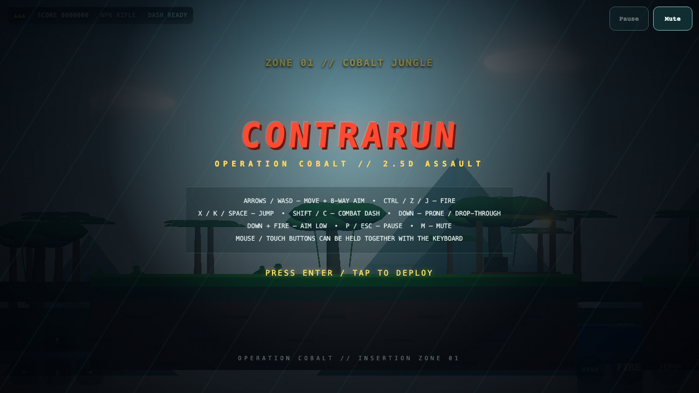
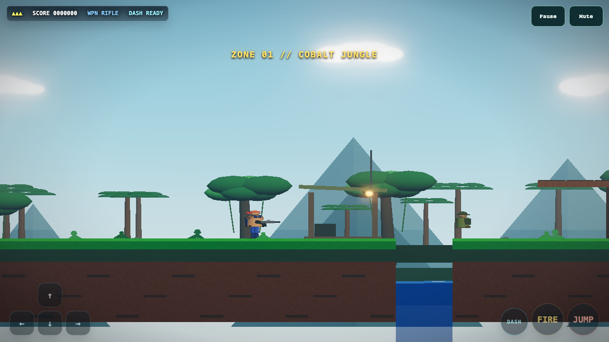

<div align="center">

# ContraRun

**A fast, browser-based 2.5D run-and-gun game built with Three.js.**

[](https://github.com/pstarwars2026/contra-run/actions/workflows/tests.yml)
[](LICENSE)
[](https://threejs.org/)

[Why this game exists](WHY.md) · [Contributing](CONTRIBUTING.md) · [Third-party notices](NOTICE)

</div>

## Screenshots





ContraRun is a self-contained arcade game inspired by classic run-and-gun pacing, rebuilt as an original browser game with a Three.js 2.5D presentation. Run, jump, dash, collect weapons, cross collapsing terrain, swim, fight through three zones, and defeat each zone boss.

The game intentionally stays lightweight: there is no account, backend, ad SDK, analytics requirement, or environment setup. Open the included page and play.

## Highlights

- Three distinct campaign zones with different terrain, atmosphere, enemies, and original MIDI-note music.
- Keyboard, mouse, and touch controls using one shared multi-source input-state system.
- Buffered jump, fire, and dash inputs so very short taps are not lost between simulation frames.
- Weapon pickups, enemy variants, destructible bridge sections, swimming, checkpoints, bosses, and New Game+.
- Original MIDI-note arrangements rendered through soft Web Audio voices, plus procedural sound effects; no recorded soundtrack files are required.
- Portable Playwright regression coverage for controls, traversal, combat, campaign progression, touch, and audio state.

## Play

Clone the repository and open `index.html` in a modern desktop browser.

```bash
git clone https://github.com/pstarwars2026/contra-run.git
cd contra-run
```

Then open or double-click `index.html` in your browser. The checked-in Three.js bundle means the game does not require a local server for normal play.

The on-screen direction, Fire, Jump, and Dash buttons also work with a desktop mouse. You can hold any on-screen button while using the keyboard at the same time—for example, hold Fire with the mouse while moving and jumping with the keyboard. On phones and tablets, landscape orientation is recommended. The page uses the device viewport and safe-area insets so controls stay clear of notches and home indicators.

## Controls

| Action | Keyboard | Mouse / Touch |
|---|---|---|
| Move | Arrow keys or WASD | Direction pad |
| Fire | Z, J, or Control | Fire button |
| Jump | X, K, or Space | Jump button |
| Dash | Shift or C | Dash button |
| Pause | P | — |
| Mute | M | — |
| Start / continue | Enter | Tap the game overlay |

## Development

Requirements: Node.js 20+ and a Chromium-compatible system for the Playwright tests.

```bash
npm install
npx playwright install chromium
npm test
```

If you change `entry.js` or the vendored Three.js integration, rebuild the browser bundle with:

```bash
npm run build:three
```

### Test suites

| Command | Coverage |
|---|---|
| `npm run test:input` | Key lifecycle, mixed mouse+keyboard holds, blur/visibility recovery, modifiers, rapid taps, pause, pointer cancellation |
| `npm run test:e2e` | Movement, combat, pickups, bridge, swimming, boss flow, victory, New Game+ |
| `npm run test:campaign` | Touch start/movement and progression through all three campaign zones |
| `npm run test:audio` | Title, stage, boss, pause, mute, and music-state transitions |
| `npm test` | Runs the full suite |

The tests build the game URL from the repository path, so they work from any clone instead of depending on one developer's filesystem.

## Architecture

```text
index.html
  └─ page markup + ordered runtime scripts

src/
  ├─ styles.css    presentation + touch controls
  ├─ core.js       Three.js aliases + gameplay tuning
  ├─ input.js      keyboard/mouse/touch input lifecycle
  ├─ audio.js      Web Audio music + sound effects
  ├─ gameplay.js   level, player, enemies, weapons, boss
  ├─ render.js     Three.js world + render synchronization
  └─ main.js       fixed-step loop + browser test API

entry.js
  └─ imports Three.js + post-processing modules
       ↓
lib/bundle-three.js
  └─ browser-ready checked-in bundle

test_*.js
  └─ Playwright regression suites against the real browser game
```

The runtime scripts are loaded in dependency order as classic browser scripts. That keeps direct `file://` play working without a local server or application bundler while making each subsystem easier to review and change.

## Input reliability

ContraRun tracks physical input sources separately from logical controls. A control stays held only while at least one source still owns it. The input manager also:

- clears active controls on blur, page hide, and tab visibility loss;
- releases a keyboard control even if a browser reports a different key identity on `keyup`;
- clears active movement when pause state changes;
- keeps keyboard, mouse, pen, and touch sources independent so mixed controls can be held together;
- catches global pointer `pointerup`, `pointercancel`, and lost pointer capture;
- buffers short jump, fire, and dash edges for several simulation frames.

These behaviors have dedicated regression tests because they are easy to break while changing gameplay code.

## Project structure

```text
.
├── .github/workflows/tests.yml   # CI
├── docs/
│   ├── images/                   # README screenshots
│   └── licenses/                 # third-party license copies
├── lib/                          # vendored Three.js r161 + browser bundle
├── src/                          # runtime code split by subsystem
├── index.html                    # page shell + runtime script loading
├── entry.js                      # Three.js bundle entry point
├── test_input.js                 # control lifecycle regressions
├── e2e_game.js                   # full gameplay E2E suite
├── test_campaign.js              # touch + campaign progression
├── test_audio.js                 # music/audio state checks
└── package.json
```

## Troubleshooting

**A key appears held after switching apps or tabs.** The current input manager clears held state on blur/visibility/page-hide. Make sure you are running the latest `main`, then run `npm run test:input` if you can reproduce a remaining case.

**Playwright cannot find Chromium.** Run `npx playwright install chromium` once after `npm install`.

**A Three.js change is not reflected in the game.** Run `npm run build:three`; the game loads the checked-in `lib/bundle-three.js` file.

## License and attribution

ContraRun source and original project materials are licensed under the [Apache License 2.0](LICENSE).

The repository vendors Three.js r161 code under `lib/`. Three.js is MIT-licensed by the Three.js authors; its license is preserved in [docs/licenses/THREEJS-LICENSE.txt](docs/licenses/THREEJS-LICENSE.txt) and summarized in [NOTICE](NOTICE).

See [CONTRIBUTING.md](CONTRIBUTING.md) before proposing a change.
